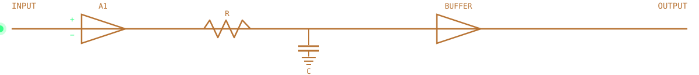

<div align="center">


</div>



## 📄 General Description

**SK-2026** is a general-purpose integrated circuit optimized for circuit-theory-to-hardware translation. The part exhibits strong simulation fidelity (LTspice), supports mixed-signal sweep operations, and is characterized by a low tolerance for unverified results. Currently shipping as an **engineering sample** — specifications subject to refinement as the device matures.

| Parameter | Value |
|:--|:--|
| Part Number | SK-2026 |
| Package | B.Tech, Electronics & Telecommunication Engg. |
| Foundry | Jadavpur University |
| Grade | Undergraduate / Active Development |
| Status | 🟢 Engineering Sample |


## 🔌 Pin Configuration — Top View

```
                    ┌──────────────────────┐
        CURIOSITY ──┤ 1                  8 ├── VERIFIED_OUTPUT
      FUNDAMENTALS ──┤ 2      SK-2026       7 ├── LTSPICE
           MATLAB ──┤ 3     (TOP VIEW)      6 ├── VERILOG
               GND ──┤ 4                   5 ├── VCC 
                    └──────────────────────┘
```

| Pin | Name | Function |
|:--:|:--|:--|
| 1 | CURIOSITY | Primary input driving all design exploration |
| 2 | FUNDAMENTALS | Reference rail — circuit theory & network analysis |
| 3 | MATLAB | Auxiliary numerical processing input |
| 4 | GND | Reference fundamentals — never floating |
| 5 | VCC | Primary supply rail |
| 6 | VERILOG / FPGA | Digital-domain output |
| 7 | LTSPICE | Core simulation & verification engine |
| 8 | VERIFIED_OUTPUT | Final output — only asserted after `.tf`/`.meas` cross-check |


## ⚡ Electrical Characteristics — Simulation & Design

| Symbol | Parameter | Conditions | Rating |
|:--:|:--|:--|:--:|
| t_LTSPICE | LTspice Proficiency | DC / AC / Transient analysis | Advanced |
| t_MATLAB | MATLAB | Numerical computation, signal processing | Proficient |


## ⚡ Electrical Characteristics — Hardware & HDL

| Symbol | Parameter | Conditions | Rating |
|:--:|:--|:--|:--:|
| t_8085 | 8085 Microprocessor | Architecture & assembly | Working knowledge |
| t_VLOG | Verilog HDL | RTL design | Developing |
| t_FPGA | FPGA | Hardware prototyping | Developing |

## ⚡ Electrical Characteristics — Measurement & Analysis

| Symbol | Parameter | Conditions | Rating |
|:--:|:--|:--|:--:|
| f_BODE | Bode Plot Analysis | Frequency response | Proficient |
| s_PZ | Pole-Zero Analysis | System stability mapping | Proficient |
| f_TF | `.tf` | Transfer function extraction | Proficient |
| n_SWEEP | `.meas` / `.step` | Parameterized measurement & sweeps | Advanced |

<div align="center">

</div>


## 🧩 Functional Block Diagram

```
 ┌────────────┐    ┌───────────────────────┐    ┌──────────────────────┐    ┌───────────────┐
 │   INPUT    │───▶│  POLE-ZERO ANALYSIS &  │───▶│  .tran / .ac DUALITY  │───▶│ SPICE vs.     │
 │ (Circuit   │    │  LINEARIZATION         │    │  (Switching ↔ Small-  │    │ THEORY CHECK  │
 │  Theorem)  │    │                        │    │   Signal Stability)   │    │               │
 └────────────┘    └───────────────────────┘    └──────────────────────┘    └──────┬────────┘
                                                                                    ▼
                                                                          ┌───────────────────┐
                                                                          │  VERIFIED OUTPUT   │
                                                                          └───────────────────┘
```

🔍 No output is asserted until simulation logs are cross-checked against manual derivation — e.g. equating real & imaginary parts of complex impedance.


## 🛠️ Applications — Reference Designs

### ⚡ [Circuit Theory to Implementation Using LTSpice](https://github.com/SubhranilKar18/Circuit-Theory-to-Implementation-Using-LTSpice)
*Application Note — structured simulations spanning fundamental circuit theorems through sub-micron CMOS behavior.*

**Sheet 1 — Active Devices (180nm CMOS)**
- Common Drain (Source Follower) — high-speed buffer; impedance transformation; mapped body effect ($g_{mb}$)
- Common Source Amplifier — voltage-divider bias; high-pass roll-off; Miller-multiplied parasitic limits
- MOSFET Characterization — nested `.dc` sweeps; extracted $V_{th}$; transconductance via `d(Id(M1))`

**Sheet 2 — Passive Networks**
- First-Order RC & RL Transients — automated $\tau$ extraction; charge/energize duality
- Maxwell L-C Bridge — frequency-independent balance; numerical pole-zero roll-off
- Maximum Power Transfer — `.step` sweeps for $R_L = R_{th}$
- Thevenin / Norton / Wheatstone Bridges — 1A test-source method; quadratic power verification


## 🔬 Device Under Test — Current Characterization

- 🟢 Deepening op-amp non-ideality analysis (offset, slew rate, GBW trade-offs)
- 🟢 Moving from schematic-level sims toward physical layout considerations
- 🟢 Strengthening fundamentals in active filter design, noise analysis, and amplifier frequency compensation


## 📦 Ordering & Contact Information

| Order Code | Channel | Link |
|:--:|:--|:--|
| SK-2026-LI | LinkedIn | [Connect](https://www.linkedin.com/in/subhranil-kar-a3a830230/) |
| SK-2026-EM | Email | [subhranilkar.ece@gmail.com](mailto:subhranilkar.ece@gmail.com) |
| SK-2026-GH | GitHub | [@SubhranilKar18](https://github.com/SubhranilKar18) |

<div align="center">

| Rev | Date | Description |
|:--:|:--:|:--|
| 1.0 | Jun 2026 | Initial characterization release |

</div>


